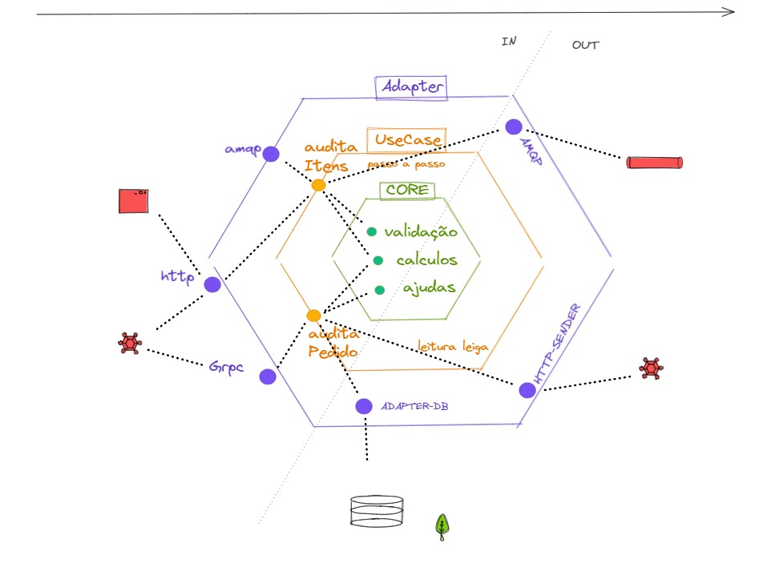

# REGISTRO DE PRODUTO EM MASSA
- registro em massa para produtos

### Logica
 - Tecnologias utilizada ;
 - Como lidou com o rolback do banco;
 - Como lidou com o envio de carga;
 - Conclusão Logica;
### Arquitetura 

 - Definição de cada Camada(Qual motivo te fez adicionar em cada camada)
 - Vatangens e desvantagens da arquitetura Hexagonal
 -
### Teste
- Pendentes finalizar os testes
- Facilidade que a arquitetura tras para o teste
- Boa praticas de teste
- Citar cada teste e o que trouxe